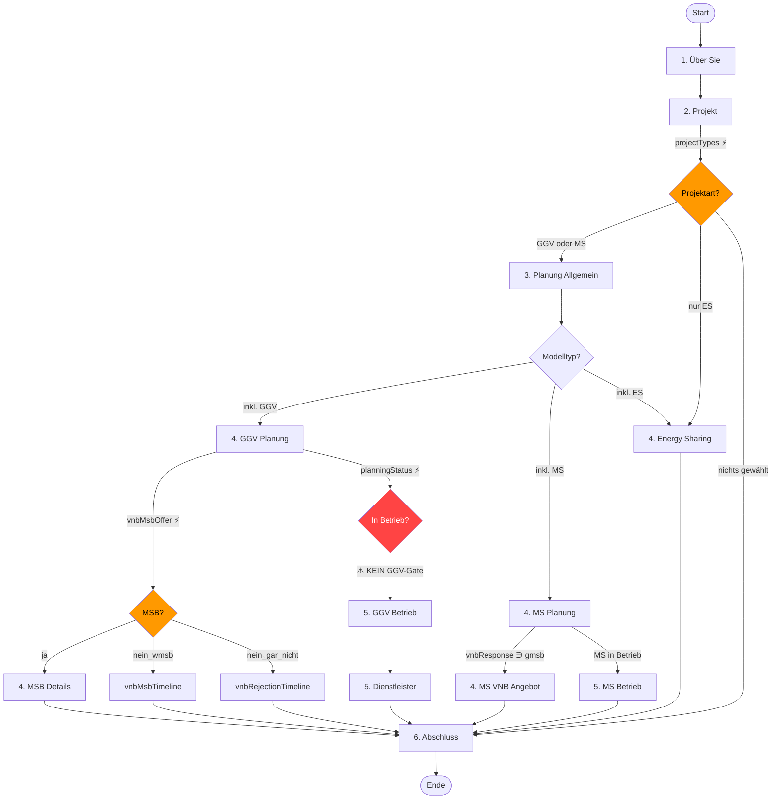

# Umfrage-Schema Audit v3.2.0

**Datum:** 2026-02-15  
**Basis:** `src/data/surveySchema.ts` (Code) + `visibilityRules.ts`  
**Status:** Analysephase – keine Code-Änderungen

---

## PHASE 1A — Struktur- & Logik-Inventory

### Sections-Übersicht

| # | Section ID | Title | visibilityRule (Klartext) | # Fragen |
|---|-----------|-------|--------------------------|----------|
| 1 | `about` | 1. Über Sie | — (immer) | 4 |
| 2 | `project` | 2. Projekt | — (immer) | 13 |
| 3 | `planning` | 3. Planung: Allgemeines – Planungsstand | projectTypes ∩ {ggv, mieterstrom, ggv_oder_mieterstrom} | 4 |
| 4 | `challenges` | 3. Planung: Allgemeines – Herausforderungen | projectTypes ∩ {ggv, mieterstrom, ggv_oder_mieterstrom} | 2 |
| 5 | `vnb-planning` | 4. Planung GGV | projectTypes ∩ {ggv, ggv_oder_mieterstrom} | 18 |
| 6 | `vnb-msb` | 4. GGV – MSB Details | vnbMsbOffer = 'ja' | 14 |
| 7 | `ggv-operation` | 5. Betrieb GGV | planningStatus ∋ 'pv_laeuft_ggv_laeuft' | 16 |
| 8 | `service-provider` | 5. Dienstleister (GGV) | projectTypes ∩ {ggv, ggv_oder_mieterstrom} | 5 |
| 9 | `mieterstrom-planning` | 4. Planung Mieterstrom | projectTypes ∋ 'mieterstrom' | 11 |
| 10 | `mieterstrom-vnb-offer` | 4. MS – VNB Angebot | mieterstromVnbResponse ∋ 'moeglich_gmsb' | 6 |
| 11 | `mieterstrom-operation` | 5. Betrieb Mieterstrom | MS_IN_OPERATION (komplex) | 13 |
| 12 | `energy-sharing` | 4. Energy Sharing | projectTypes ∋ 'energysharing' | 16 |
| 13 | `final` | 6. Abschluss | — (immer) | 4 |

**Gesamt: 13 Sections, ~126 Fragen**

---

### Detailliertes Fragen-Inventory

#### Section 1: `about` (immer sichtbar)

| ID | Type | Req/Opt | visibilityRule | Options | Notes |
|----|------|---------|---------------|---------|-------|
| actorTypes | multi-select | optional | — | 12 | hasTextField bei 3 Optionen |
| motivation | multi-select | optional | — | 4 | hasTextField bei 'sonstiges' |
| contactEmail | email | optional | — | — | |
| confirmationForUpdate | single-select | optional | — | 2 | |

#### Section 2: `project` (immer sichtbar)

| ID | Type | Req/Opt | visibilityRule | Options | Notes |
|----|------|---------|---------------|---------|-------|
| vnbName | vnb-select | optional | — | — | Custom Combobox |
| projectTypes | multi-select | **required** | — | 4 | ⚡ Hauptverzweigung |
| planningStatus | single-select | **required** | PT_GGV_OR_MS | 7 | ⚡ Gate für Betrieb; hasTextField |
| mieterstromPlanningStatus | single-select | **required** | PT_MS ∧ PT_GGV | 7 | Nur wenn GGV+MS gleichzeitig |
| ggvProjectType | single-select | — | PT_GGV_OR_MS | 2 | ⚠️ **BUG**: auch bei reinem MS sichtbar |
| ggvPvSizeKw | number | optional | PT_GGV | — | |
| ggvPartyCount | number | optional | PT_GGV | — | |
| ggvBuildingType | single-select | — | PT_GGV | 3 | |
| ggvBuildingCount | number | optional | PT_GGV ∧ ggvProjectType='multiple' | — | |
| ggvAdditionalInfo | textarea | optional | PT_GGV | — | |
| mieterstromPvSizeKw | number | optional | PT_MS | — | |
| mieterstromPartyCount | number | optional | PT_MS | — | |
| mieterstromBuildingType | single-select | — | PT_MS | 3 | |
| mieterstromAdditionalInfo | textarea | optional | PT_MS | — | |
| projectLocations | text | optional | PT_GGV_OR_MS | — | |

#### Section 3: `planning` (PT_GGV_OR_MS)

| ID | Type | Req/Opt | visibilityRule | Options | Notes |
|----|------|---------|---------------|---------|-------|
| ggvOrMieterstromDecision | single-select | — | PT_GGV_OR_MS | 3 | Redundant mit Section-Gate |
| ggvDecisionReasons | multi-select | — | PT_GGV | 6 | |
| mieterstromDecisionReasons | multi-select | — | PT_MS_OR_BOTH | 6 | |
| implementationApproach | multi-select | — | — | 3 | |

#### Section 4: `challenges` (PT_GGV_OR_MS)

| ID | Type | Req/Opt | visibilityRule | Options | Notes |
|----|------|---------|---------------|---------|-------|
| challenges | multi-select | optional | — | 6 | exclusive bei 'keine'; hasTextField bei 4 |
| vnbRejectionResponse | multi-select | optional | — | 4 | hasTextField bei 2 |

#### Section 5: `vnb-planning` (PT_GGV)

| ID | Type | Req/Opt | visibilityRule | Options | Notes |
|----|------|---------|---------------|---------|-------|
| vnbExistingProjects | single-select | — | — | 5 | |
| vnbContact | multi-select | optional | — | 4 | |
| vnbResponse | multi-select | optional | — | 4 | |
| vnbMsbOffer | single-select | — | — | 3 | ⚡ Gate für vnb-msb Section |
| vnbMsbTimeline | single-select | — | vnbMsbOffer='nein_wmsb' | 4 | ✅ Fix: verschoben aus vnb-msb |
| vnbRejectionTimeline | single-select | — | vnbMsbOffer='nein_gar_nicht' | 4 | ✅ Fix: verschoben aus vnb-msb |
| vnbSupportMesskonzept | single-select | optional | — | 2 | |
| vnbSupportFormulare | single-select | optional | — | 2 | |
| vnbSupportPortal | single-select | optional | — | 2 | |
| vnbSupportOther | text | optional | — | — | |
| vnbContactHelpful | single-select | — | — | 4 | |
| vnbPersonalContacts | single-select | — | — | 4 | |
| vnbSupportRating | rating | — | — | 1–10 | |
| vnbWandlermessung | single-select | — | — | 3 | |
| vnbWandlermessungComment | textarea | optional | vnbWandlermessung ∈ {ja, wissen_nicht} | — | |
| vnbWandlermessungDocuments | file | optional | vnbWandlermessung ∈ {ja, wissen_nicht} | — | |
| vnbPlanningDuration | single-select | — | — | 3 | |
| vnbPlanningDurationReasons | textarea | optional | — | — | |

#### Section 6: `vnb-msb` (vnbMsbOffer='ja')

| ID | Type | Req/Opt | visibilityRule | Options | Notes |
|----|------|---------|---------------|---------|-------|
| vnbStartTimeline | single-select | — | vnbMsbOffer='ja' | 5 | Redundant mit Section-Gate |
| vnbAdditionalCosts | single-select | — | vnbMsbOffer='ja' | 3 | Redundant mit Section-Gate |
| vnbAdditionalCostsOneTime | number | optional | vnbAdditionalCosts='ja' | — | conditionalRequired |
| vnbAdditionalCostsYearly | number | optional | vnbAdditionalCosts='ja' | — | conditionalRequired |
| vnbFullService | single-select | — | vnbMsbOffer='ja' | 2 | Redundant mit Section-Gate |
| vnbDataProvision | multi-select | — | vnbMsbOffer='ja' | 5 | Redundant mit Section-Gate |
| vnbDataCost | single-select | — | vnbMsbOffer='ja' | 5 | Redundant mit Section-Gate |
| vnbDataCostAmount | number | optional | vnbDataCost='mehr_3_eur' | — | |
| vnbEsaCost | single-select | — | vnbMsbOffer='ja' | 4 | Redundant mit Section-Gate |
| vnbEsaCostAmount | number | optional | vnbEsaCost='mehr_3_eur' | — | |
| vnbWandlermessung (Sect.) | — | — | — | — | ⬆ In vnb-planning, nicht hier |
| vnbPlanningDuration (Sect.) | — | — | — | — | ⬆ In vnb-planning, nicht hier |

**Hinweis:** Viele Fragen in vnb-msb haben `visibilityRule: eq('vnbMsbOffer', 'ja')` obwohl die Section selbst schon dieses Gate hat → redundant aber nicht schädlich.

#### Section 7: `ggv-operation` (GGV_IN_OPERATION)

| ID | Type | Req/Opt | visibilityRule | Options | Notes |
|----|------|---------|---------------|---------|-------|
| operationVnbDuration | single-select | — | — | 3 | |
| operationVnbDurationReasons | textarea | optional | — | — | |
| operationWandlermessung | single-select | — | — | 4 | |
| operationWandlermessungComment | textarea | optional | operationWandlermessung='ja' | — | |
| operationMsbProvider | single-select | — | — | 2 | ⚡ Gate für Folgefragen |
| operationAllocationProvider | single-select | — | — | 3 | |
| operationDataProvider | single-select | — | — | 4 | ⚡ Gate für Datenkostenfragen |
| operationMsbDuration | single-select | — | operationMsbProvider='gmsb' | 4 | |
| operationMsbAdditionalCosts | single-select | — | operationMsbProvider='gmsb' | 3 | |
| operationMsbAdditionalCostsOneTime | number | optional | operationMsbAdditionalCosts='ja' | — | |
| operationMsbAdditionalCostsYearly | number | optional | operationMsbAdditionalCosts='ja' | — | |
| operationDataFormat | single-select | — | — | 6 | |
| operationDataCost | single-select | — | operationDataProvider='gmsb' | 5 | |
| operationDataCostAmount | number | optional | operationDataCost='mehr_3_eur' | — | |
| operationEsaCost | single-select | — | operationDataProvider='gmsb' | 4 | |
| operationEsaCostAmount | number | optional | operationEsaCost='mehr_3_eur' | — | |
| operationSatisfactionRating | rating | — | — | 1–10 | |

⚠️ **BUG: Section hat KEIN projectTypes-Gate** → auch bei reinem Mieterstrom sichtbar, wenn planningStatus='pv_laeuft_ggv_laeuft'.

#### Section 8: `service-provider` (PT_GGV)

| ID | Type | Req/Opt | visibilityRule | Options | Notes |
|----|------|---------|---------------|---------|-------|
| serviceProviderName | text | optional | — | — | |
| serviceProviderComments | textarea | optional | serviceProviderName filled | — | |
| serviceProvider2Name | text | optional | serviceProviderName filled | — | |
| serviceProvider2Rating | rating | optional | serviceProvider2Name filled | 1–10 | |
| serviceProvider2Comments | textarea | optional | serviceProvider2Name filled | — | |

#### Section 9: `mieterstrom-planning` (PT_MS)

| ID | Type | Req/Opt | visibilityRule | Options | Notes |
|----|------|---------|---------------|---------|-------|
| mieterstromSummenzaehler | single-select | — | — | 5 | |
| mieterstromExistingProjects | single-select | — | — | 5 | |
| mieterstromExistingProjectsVirtuell | single-select | — | — | 5 | |
| mieterstromVnbContact | multi-select | optional | — | 4 | |
| mieterstromVirtuellAllowed | single-select | — | — | 3 | ⚡ Gate |
| mieterstromVirtuellDeniedReason | textarea | optional | mieterstromVirtuellAllowed='nein' | — | |
| mieterstromVirtuellDeniedDocuments | file | optional | mieterstromVirtuellAllowed='nein' | — | |
| mieterstromVirtuellWandlermessung | single-select | — | mieterstromVirtuellAllowed='ja' | 2 | |
| mieterstromVirtuellWandlermessungDocuments | file | optional | mieterstromVirtuellWandlermessung='ja' | — | |
| mieterstromVnbResponse | multi-select | optional | — | 4 | ⚡ Gate für VNB-Angebot |
| mieterstromSupportRating | rating | — | — | 1–10 | |

#### Section 10: `mieterstrom-vnb-offer` (mieterstromVnbResponse ∋ 'moeglich_gmsb')

| ID | Type | Req/Opt | visibilityRule | Options | Notes |
|----|------|---------|---------------|---------|-------|
| mieterstromFullService | single-select | — | — | 2 | |
| mieterstromMsbCosts | single-select | — | — | 4 | |
| mieterstromMsbCostsOneTime | number | optional | mieterstromMsbCosts='ja' | — | conditionalRequired |
| mieterstromMsbCostsYearly | number | optional | mieterstromMsbCosts='ja' | — | conditionalRequired |
| mieterstromModelChoice | single-select | — | — | 3 | |
| mieterstromDataProvision | single-select | — | — | 3 | |

#### Section 11: `mieterstrom-operation` (MS_IN_OPERATION)

MS_IN_OPERATION = PT_MS ∧ (mieterstromPlanningStatus ∋ 'pv_laeuft_ggv_laeuft' ∨ (¬PT_GGV ∧ planningStatus ∋ 'pv_laeuft_ggv_laeuft'))

| ID | Type | Req/Opt | visibilityRule | Options | Notes |
|----|------|---------|---------------|---------|-------|
| mieterstromVnbRole | single-select | — | — | 4 | |
| mieterstromVnbDuration | single-select | — | — | 3 | |
| mieterstromVnbDurationReasons | textarea | optional | — | — | |
| mieterstromWandlermessung | single-select | — | — | 3 | |
| mieterstromMsbInstallDuration | single-select | — | — | 4 | |
| mieterstromOperationCosts | single-select | — | — | 3 | |
| mieterstromOperationCostsOneTime | number | optional | mieterstromOperationCosts='ja' | — | |
| mieterstromOperationCostsYearly | number | optional | mieterstromOperationCosts='ja' | — | |
| mieterstromRejectionResponse | multi-select | optional | — | 4 | |
| mieterstromInfoSources | textarea | optional | — | — | |
| mieterstromExperiences | textarea | optional | — | — | |

#### Section 12: `energy-sharing` (PT_ES)

| ID | Type | Req/Opt | visibilityRule | Options | Notes |
|----|------|---------|---------------|---------|-------|
| esStatus | single-select | optional | — | 5 | ⚠️ TypeScript-Typ ist string[] |
| esInOperationDetails | textarea | optional | ES_IN_OPERATION | — | ⚠️ Möglicherweise unerreichbar |
| esOperatorDetails | textarea | optional | ES_IN_OPERATION | — | ⚠️ Möglicherweise unerreichbar |
| esPlantType | multi-select | — | — | 7 | |
| esProjectScope | single-select | — | — | 2 | |
| esCapacitySizeKw | number | optional | — | — | |
| esTechnologyDescription | textarea | optional | — | — | |
| esPartyCount | number | optional | — | — | |
| esConsumerTypes | multi-select | — | — | 5 | |
| esConsumerDetails | textarea | optional | — | — | |
| esConsumerScope | single-select | — | — | 4 | |
| esMaxDistance | text | optional | — | — | |
| esVnbContact | single-select | — | — | 2 | ⚠️ Werte: yes/no statt ja/nein |
| esVnbResponse | single-select | — | esVnbContact='yes' | 6 | |
| esNetzentgelteDiscussion | single-select | — | esVnbContact='yes' | 3 | |
| esInfoSources | textarea | optional | — | — | |

#### Section 13: `final` (immer sichtbar)

| ID | Type | Req/Opt | visibilityRule | Options | Notes |
|----|------|---------|---------------|---------|-------|
| additionalExperiences | textarea | optional | — | — | |
| documentUpload | file | optional | — | — | |
| surveyImprovements | textarea | optional | — | — | |
| npsScore | rating | optional | PT_GGV_OR_MS | 0–10 | |

---

### Priorisierte Issues

#### 🔴 Kritisch (Logikfehler, falsche Daten)

| # | Issue | Section/Frage | Beschreibung | Status |
|---|-------|-------------|-------------|--------|
| C1 | **ggv-operation ohne GGV-Gate** | `ggv-operation` Section | Section-visibilityRule ist `GGV_IN_OPERATION()` = `inc('planningStatus', 'pv_laeuft_ggv_laeuft')`. Es fehlt ein `PT_GGV()` Gate. → Bei reinem Mieterstrom + planningStatus='pv_laeuft_ggv_laeuft' werden alle GGV-Betriebsfragen angezeigt. | 🐛 Offen |
| C2 | **getProjectFlags.isGgvInOperation ohne GGV-Gate** | `visibilityRules.ts:147` | `isGgvInOperation` prüft nur planningStatus, nicht ob GGV ausgewählt ist. Gleicher Bug wie C1, betrifft auch die Step-Sichtbarkeit. | 🐛 Offen |
| C3 | **ES_IN_OPERATION nutzt equalsAny auf Array-Feld** | `visibilityRules.ts:175-176` | `ES_IN_OPERATION()` nutzt `equalsAny` (prüft `typeof val === 'string'`), aber `esStatus` ist in DB `text[]` (bestätigt: ein Datensatz hat `['in_betrieb_vollversorgung', 'info_sammeln']`). `equalsAny` gibt **immer false** zurück → `esInOperationDetails` und `esOperatorDetails` sind **unerreichbar**. | 🔴 **Bestätigt** |
| C4 | **esVnbContact: boolean vs string Typ-Konflikt** | `energy-sharing` | Schema: single-select mit Werten `yes`/`no`. DB: `boolean` (bestätigt: Wert ist `true`, nicht `'yes'`). `eq('esVnbContact', 'yes')` vergleicht `true === 'yes'` → **immer false** → `esVnbResponse` und `esNetzentgelteDiscussion` sind **unerreichbar**. | 🔴 **Bestätigt** |

#### 🟡 Mittel (falsche Sichtbarkeit, UX-Problem)

| # | Issue | Section/Frage | Beschreibung | Status |
|---|-------|-------------|-------------|--------|
| M1 | **ggvProjectType bei reinem Mieterstrom sichtbar** | `project.ggvProjectType` | visibilityRule: `PT_GGV_OR_MS()` – enthält 'mieterstrom'. Die Frage fragt nach "GGV-Projekten" und ist bei reinem MS irrelevant. Sollte `PT_GGV()` sein. | 🐛 Offen |
| M2 | **Inkonsistente Werte: yes/no vs ja/nein** | `energy-sharing.esVnbContact` | Einzige Frage mit `yes`/`no` statt `ja`/`nein`. Inkonsistenz mit dem Rest der Umfrage. | 🟡 Offen |
| M3 | **Redundante visibilityRules in vnb-msb** | `vnb-msb.*` | 7 Fragen haben `eq('vnbMsbOffer', 'ja')`, obwohl Section-Gate identisch ist. Nicht schädlich, aber unnötige Komplexität. | ℹ️ Low |

#### 🟢 Gelöst (aus vorherigen Iterationen)

| # | Issue | Beschreibung | Status |
|---|-------|-------------|--------|
| R1 | vnbMsbTimeline/vnbRejectionTimeline unerreichbar in vnb-msb | Verschoben nach vnb-planning | ✅ Gelöst |
| R2 | vnbRejectionResponse in falscher Section | Verschoben nach challenges | ✅ Gelöst |

---

### High-Level Flow (Mermaid)

---

## PHASE 1B — Testkonzepte (nicht ausgeführt)

### Testmatrix: Happy Paths

| Pfad | projectTypes | planningStatus | Erwartete Sections | Gate-Felder |
|------|-------------|---------------|-------------------|-------------|
| **GGV Planung** | ['ggv'] | 'info_sammeln' | about, project, planning, challenges, vnb-planning, final | projectTypes, vnbMsbOffer |
| **GGV Betrieb** | ['ggv'] | 'pv_laeuft_ggv_laeuft' | + ggv-operation, service-provider | planningStatus |
| **GGV + MSB ja** | ['ggv'] | any | + vnb-msb | vnbMsbOffer='ja' |
| **MS Planung** | ['mieterstrom'] | 'info_sammeln' | about, project, planning, challenges, mieterstrom-planning, final | — |
| **MS Betrieb** | ['mieterstrom'] | 'pv_laeuft_ggv_laeuft' | + mieterstrom-operation | planningStatus |
| **GGV + MS** | ['ggv','mieterstrom'] | 'pv_laeuft_ggv_laeuft' | Alle GGV + MS Sections | mieterstromPlanningStatus |
| **Nur ES** | ['energysharing'] | — | about, project, energy-sharing, final | — |
| **GGV + ES** | ['ggv','energysharing'] | 'info_sammeln' | GGV + ES Sections | — |

### Negative Tests

| Test | Eingabe | Erwartetes Ergebnis |
|------|---------|-------------------|
| **N1: Required leer** | projectTypes=[], Submit | Validierungsfehler |
| **N2: Wechsel MS→GGV** | MS ausfüllen, dann MS abwählen, GGV wählen | MS-Fragen ausgeblendet, Daten im Draft erhalten |
| **N3: Reload** | Teilweise ausfüllen, Reload | Draft-Restoration Banner |
| **N4: Back/Forward** | Mehrmals zwischen Steps wechseln | Daten bleiben erhalten |
| **N5: ⚠️ Reiner MS + Betrieb** | ['mieterstrom'], planningStatus='pv_laeuft_ggv_laeuft' | ❌ BUG: GGV-Operation Section erscheint (C1) |
| **N6: ES In-Betrieb** | ['energysharing'], esStatus='in_betrieb_vollversorgung' | ❌ Mögl. BUG: Details-Fragen nicht sichtbar (C3) |

### UI/Accessibility Checks

| Check | Beschreibung | Priorität |
|-------|-------------|-----------|
| Tab/Focus | Alle Fragen per Tab erreichbar | Mittel |
| Labels | Alle Inputs haben zugehörige Labels | Mittel |
| Mobile | Responsive ab 320px | Hoch |
| Screenreader | aria-labels für Rating-Skalen | Niedrig |

---

## PHASE 1C — Schema-Export Prüfung

| Prüfpunkt | Ergebnis |
|-----------|----------|
| URL | `https://www.vnb-transparenz.de/data/umfrage-schema.json` |
| lovable.json static paths | ✅ `/data/*` konfiguriert |
| lovable.json fallback exclude | ✅ `/data/*` ausgeschlossen |
| vercel.json routes | ✅ `/data/(.*)` → `/data/$1` |
| _redirects | ✅ `/data/*` → `/data/:splat` 200 |
| _headers Content-Type | ✅ `application/json; charset=utf-8` |
| **Live-Test** | ⚠️ Fetch über Tool gab HTML zurück – vermutlich Preview-URL statt published Domain. **Manueller Test auf published Domain empfohlen.** |

---

## PHASE 2 — Umsetzungsoptionen

### Option 1: Minimal-Fix (nur visibilityRules)

**Betroffene Stellen:**
- `visibilityRules.ts`: `GGV_IN_OPERATION` um `PT_GGV()` erweitern
- `visibilityRules.ts`: `getProjectFlags.isGgvInOperation` um GGV-Check erweitern
- `visibilityRules.ts`: `ES_IN_OPERATION` von `equalsAny` auf `includesAny` ändern (falls esStatus als Array gespeichert)
- `surveySchema.ts`: `ggvProjectType` visibilityRule von `PT_GGV_OR_MS()` auf `PT_GGV()` ändern

| Merkmal | Bewertung |
|---------|-----------|
| **Aufwand** | S (klein, ~4 Zeilen) |
| **Risiko** | Niedrig |
| **Nutzen** | Fixt C1, C2, M1, evtl. C3 |
| **Breaking Changes** | Nein (bestehende Daten unverändert) |

### Option 2: Leichter Refactor + Wertevereinheitlichung

**Alles aus Option 1, plus:**
- `energy-sharing.esVnbContact`: Optionswerte `yes`/`no` → `ja`/`nein` ändern (M2)
- `esVnbContact` TypeScript-Typ von `boolean` auf `string` (C4)
- Redundante visibilityRules in `vnb-msb` Section entfernen (M3)
- Ggf. `esStatus` TypeScript-Typ von `string[]` auf `string` korrigieren

| Merkmal | Bewertung |
|---------|-----------|
| **Aufwand** | M (mittel, ~15 Zeilen + Typ-Änderungen) |
| **Risiko** | Mittel – esVnbContact-Wertänderung betrifft bestehende DB-Einträge |
| **Nutzen** | Fixt C1-C4, M1-M3, konsistentere Codebasis |
| **Breaking Changes** | **Ja**: esVnbContact yes→ja erfordert DB-Migration ODER Dual-Check |

### Option 3: Automatisierte Schema-Validierung

**Neues Script `scripts/validate-schema.ts`:**
- Prüft automatisch: Section-Gate vs. Question-visibilityRule Widersprüche
- Prüft: equalsAny/equals auf Array-Felder (TypeScript-Typ-Prüfung)
- Prüft: Alle Optionswerte konsistent (ja/nein, nicht yes/no)
- Kann in CI (pre-commit hook oder Build-Step) laufen

| Merkmal | Bewertung |
|---------|-----------|
| **Aufwand** | M (mittel, neues Script ~100 Zeilen) |
| **Risiko** | Niedrig (additiv, ändert nichts Bestehendes) |
| **Nutzen** | Verhindert zukünftige Logik-Bugs systematisch |
| **Breaking Changes** | Nein |

### Option 4: E2E-Tests (Playwright)

**Nicht empfohlen im aktuellen Setup:** Das Projekt nutzt Vite + React ohne Playwright-Setup. Lovable Cloud unterstützt kein Playwright nativ. Alternative: Die Testmatrix aus Phase 1B kann manuell oder mit dem Browser-Tool validiert werden.

| Merkmal | Bewertung |
|---------|-----------|
| **Aufwand** | L (groß, Playwright-Setup + Tests) |
| **Risiko** | Mittel (neues Tooling) |
| **Nutzen** | Langfristig wertvoll, kurzfristig Overkill |
| **Breaking Changes** | Nein |

---

## Offene Fragen

Die folgenden Fragen müssen VOR der Umsetzung beantwortet werden:

### Frage 1 (vom User bereits gestellt)
> Soll `ggv_oder_mieterstrom` wie "beides anzeigen" funktionieren (GGV+Mieterstrom-Sections), oder nur eine Entscheidungsstrecke?

**Aktueller Stand:** `ggv_oder_mieterstrom` wird von `PT_GGV()` und `PT_MS_OR_BOTH()` inkludiert, zeigt also **beide** Pfade an. Das scheint beabsichtigt.

### Frage 2 (vom User bereits gestellt)
> Soll `ggv-operation` strikt nur bei GGV-Pfaden sichtbar sein?

**Empfehlung:** Ja, `GGV_IN_OPERATION` sollte `and(PT_GGV(), inc('planningStatus', 'pv_laeuft_ggv_laeuft'))` sein.

### Frage 3 (vom User bereits gestellt)
> Wo sollen vnbMsbTimeline/vnbRejectionTimeline hin?

**Status:** ✅ Bereits nach `vnb-planning` verschoben (letzte Änderung).

### Frage 4 (vom User bereits gestellt)
> Dürfen Antwortwerte vereinheitlicht werden (yes/no → ja/nein)?

**Kontext:** Betrifft nur `esVnbContact`. DB-Spalte ist `boolean`, nicht `string`. Frage ist, ob bestehende Daten mit `true`/`false` oder `'yes'`/`'no'` gespeichert sind.

### Frage 5 (vom User bereits gestellt)
> Ist es ok, questionIds zu ändern?

**Default:** Nein.

### Neue Frage 6
> Wie wird `esStatus` tatsächlich gespeichert?

**✅ Beantwortet durch DB-Prüfung:** `esStatus` ist `text[]` (Array). Ein Datensatz enthält sogar zwei Werte: `['in_betrieb_vollversorgung', 'info_sammeln']`. C3 ist ein **bestätigter Bug**. Fix: `ES_IN_OPERATION` von `equalsAny` auf `includesAny` ändern.

### Neue Frage 7
> Wie wird `esVnbContact` tatsächlich gespeichert?

**✅ Beantwortet durch DB-Prüfung:** `esVnbContact` ist `boolean` (Wert: `true`). C4 ist ein **bestätigter Bug**. Fix: Entweder die visibilityRule auf boolean-Vergleich umstellen (neuer Operator nötig) oder das Schema auf `ja`/`nein` String-Werte umstellen.

### Neue Frage 8 (aus DB-Prüfung)
> `esStatus` hat in einem Datensatz **zwei Werte** (`['in_betrieb_vollversorgung', 'info_sammeln']`), obwohl das Schema `single-select` sagt. War `esStatus` früher `multi-select`? Soll es das bleiben oder auf echtes single-select umgestellt werden?

---

## Zusammenfassung

| Kategorie | Anzahl |
|-----------|--------|
| 🔴 Kritische Issues | 4 (C1-C4) |
| 🟡 Mittlere Issues | 3 (M1-M3) |
| 🟢 Bereits gelöst | 2 (R1-R2) |
| Umsetzungsoptionen | 4 |
| Offene Fragen | 7 |

**Empfehlung:** Option 1 (Minimal-Fix) sofort, Option 3 (Validierung) mittelfristig. Option 2 nur nach Klärung der Datenlage (Fragen 6+7).
