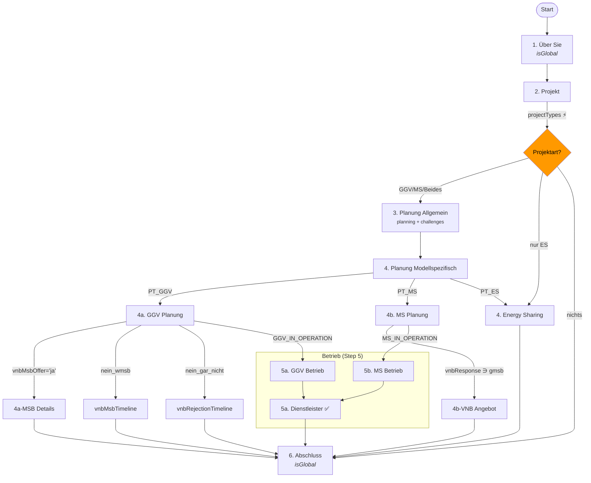

# Umfrage-Audit

**Datum:** 2026-02-16  
**Basis:** `surveySchema.ts` v3.2.0, `visibilityRules.ts`, `surveySteps.ts`, `SurveyRenderer.tsx`, `Survey.tsx`  
**Zweck:** Vollständige Dokumentation der Umfrage-Architektur, Sichtbarkeitslogik und bekannter Issues

---

## 1. Architektur-Überblick

### Unidirektionaler Datenfluss

```
surveySchema.ts (SSOT) → visibilityRules.ts (Rule Engine) → SurveyRenderer.tsx (UI)
                                                               ↑
surveySteps.ts (Step-Gruppierung) → Survey.tsx (Navigation) ───┘
```

### Drei-Ebenen-Sichtbarkeit (Kaskadierende Gates)

| Ebene | Definiert in | Mechanismus | Beschreibung |
|-------|-------------|-------------|-------------|
| **1. Schritt** | `surveySteps.ts` | `isVisible(data)` | Steuert Navigations-Tabs. Nutzt `getProjectFlags()` |
| **2. Sektion** | `surveySchema.ts` | `visibilityRule` | Steuert Sektionsblöcke innerhalb eines Schritts |
| **3. Frage** | `surveySchema.ts` | `visibilityRule` | Steuert einzelne Fragen innerhalb einer Sektion |

Ist eine übergeordnete Ebene unsichtbar, werden alle darin enthaltenen Elemente ebenfalls ausgeblendet, unabhängig von deren individuellen Regeln.

### Multi-Evaluation-System

Nutzer können mehrere VNB-Bewertungen (Tabs) innerhalb einer Sitzung anlegen. Schritte mit `isGlobal: true` (about, final) teilen Daten über alle Tabs. Jeder Tab erzeugt eine eigene Zeile in `survey_responses`, verknüpft über eine gemeinsame `session_group_id` (UUID).

### Datenfilterung beim Absenden

`buildDbData()` ruft `getVisibleQuestionIds()` auf und filtert alle Antworten heraus, deren Fragen zum Zeitpunkt des Absendens nicht sichtbar sind. Verwaiste Daten bleiben im lokalen Draft erhalten.

---

## 2. Schritt-Definitionen

| # | Step ID | Titel | Sections | isVisible | isGlobal |
|---|---------|-------|----------|-----------|----------|
| 1 | `about` | Über Sie | about | — (immer) | ✅ |
| 2 | `project` | Projekt | project | — (immer) | — |
| 3 | `planning-general` | Planung: Allgemeines | planning, challenges | `isGgvOrMieterstrom` | — |
| 4 | `planning-model` | Planung: Modellspezifisch | vnb-planning, vnb-msb, mieterstrom-planning, mieterstrom-vnb-offer, energy-sharing | `projectTypes.length > 0` | — |
| 5 | `operation-model` | Betrieb: Modellspezifisch | ggv-operation, service-provider, mieterstrom-operation | `isGgvOrMieterstrom && (isGgvInOperation \|\| isMieterstromInOperation)` | — |
| 6 | `final` | Abschluss | final | — (immer) | ✅ |

---

## 3. Sections-Übersicht

| # | Section ID | Titel | visibilityRule | Fragen |
|---|-----------|-------|---------------|--------|
| 1 | `about` | 1. Über Sie | — | 4 |
| 2 | `project` | 2. Projekt | — | 15 |
| 3 | `planning` | 3. Planung: Allgemeines – Planungsstand | PT_GGV_OR_MS | 4 |
| 4 | `challenges` | 3. Planung: Allgemeines – Herausforderungen | PT_GGV_OR_MS | 2 |
| 5 | `vnb-planning` | 4. Planung GGV | PT_GGV | 18 |
| 6 | `vnb-msb` | 4. GGV – MSB Details | eq('vnbMsbOffer', 'ja') | 10 |
| 7 | `ggv-operation` | 5. Betrieb GGV | GGV_IN_OPERATION ⚠️ | 17 |
| 8 | `service-provider` | 5. Dienstleister (GGV) | PT_GGV | 5 |
| 9 | `mieterstrom-planning` | 4. Planung Mieterstrom | PT_MS | 11 |
| 10 | `mieterstrom-vnb-offer` | 4. MS – VNB Angebot | inc('mieterstromVnbResponse', 'moeglich_gmsb') | 6 |
| 11 | `mieterstrom-operation` | 5. Betrieb Mieterstrom | MS_IN_OPERATION | 11 |
| 12 | `energy-sharing` | 4. Energy Sharing | PT_ES | 16 |
| 13 | `final` | 6. Abschluss | — | 4 |

**Gesamt: 13 Sections, 123 Fragen**

---

## 4. Detailliertes Fragen-Inventar

### 4.1 Section `about` (immer sichtbar)

| UI# | ID | Type | Req/Opt | visibilityRule | Opts | Notes |
|-----|-----|------|---------|---------------|------|-------|
| 1.1 | actorTypes | multi-select | opt | — | 12 | hasTextField bei 3 Opts |
| 1.2 | motivation | multi-select | opt | — | 4 | hasTextField bei 'sonstiges' |
| 1.3 | contactEmail | email | opt | — | — | |
| 1.4 | confirmationForUpdate | single-select | opt | — | 2 | |

### 4.2 Section `project` (immer sichtbar)

| UI# | ID | Type | Req/Opt | visibilityRule | Opts | Notes |
|-----|-----|------|---------|---------------|------|-------|
| 2.1 | vnbName | vnb-select | opt | — | — | Custom Combobox |
| 2.2 | projectTypes | multi-select | **req** | — | 4 | ⚡ Hauptverzweigung |
| 2.3 | planningStatus | single-select | **req** | PT_GGV_OR_MS | 7 | ⚡ Gate für Betrieb; array-wrapped |
| 2.3b | mieterstromPlanningStatus | single-select | **req** | PT_MS ∧ PT_GGV | 7 | Nur wenn GGV+MS gleichzeitig; array-wrapped |
| 2.4 | ggvProjectType | single-select | — | PT_GGV_OR_MS | 2 | ⚠️ **M1**: Sollte PT_GGV sein |
| 2.6 | ggvPvSizeKw | number | opt | PT_GGV | — | |
| 2.7 | ggvPartyCount | number | opt | PT_GGV | — | |
| 2.8 | ggvBuildingType | single-select | — | PT_GGV | 3 | |
| 2.5 | ggvBuildingCount | number | opt | PT_GGV ∧ eq('ggvProjectType', 'multiple') | — | |
| 2.9 | ggvAdditionalInfo | textarea | opt | PT_GGV | — | |
| 2.10 | mieterstromPvSizeKw | number | opt | PT_MS | — | |
| 2.11 | mieterstromPartyCount | number | opt | PT_MS | — | |
| 2.12 | mieterstromBuildingType | single-select | — | PT_MS | 3 | |
| 2.13 | mieterstromAdditionalInfo | textarea | opt | PT_MS | — | |
| 2.14 | projectLocations | text | opt | PT_GGV_OR_MS | — | ProjectLocationRows-Komponente |

### 4.3 Section `planning` (PT_GGV_OR_MS)

| UI# | ID | Type | Req/Opt | visibilityRule | Opts | Notes |
|-----|-----|------|---------|---------------|------|-------|
| 3.1 | ggvOrMieterstromDecision | single-select | — | PT_GGV_OR_MS | 3 | Redundant mit Section-Gate |
| 3.2 | ggvDecisionReasons | multi-select | — | PT_GGV | 6 | |
| 3.3 | mieterstromDecisionReasons | multi-select | — | PT_MS_OR_BOTH | 6 | |
| 3.4 | implementationApproach | multi-select | — | — | 3 | |

### 4.4 Section `challenges` (PT_GGV_OR_MS)

| UI# | ID | Type | Req/Opt | visibilityRule | Opts | Notes |
|-----|-----|------|---------|---------------|------|-------|
| 3.5 | challenges | multi-select | opt | — | 6 | exclusive bei 'keine'; hasTextField bei 4 |
| 3.6 | vnbRejectionResponse | multi-select | opt | — | 4 | hasTextField bei 2 |

### 4.5 Section `vnb-planning` (PT_GGV)

| UI# | ID | Type | Req/Opt | visibilityRule | Opts | Notes |
|-----|-----|------|---------|---------------|------|-------|
| 4.1 | vnbExistingProjects | single-select | — | — | 5 | |
| 4.2 | vnbContact | multi-select | opt | — | 4 | |
| 4.3 | vnbResponse | multi-select | opt | — | 4 | |
| 4.4 | vnbMsbOffer | single-select | — | — | 3 | ⚡ Gate für vnb-msb Section |
| 4.15 | vnbMsbTimeline | single-select | — | eq('vnbMsbOffer', 'nein_wmsb') | 4 | |
| 4.16 | vnbRejectionTimeline | single-select | — | eq('vnbMsbOffer', 'nein_gar_nicht') | 4 | |
| 4.22 | vnbSupportMesskonzept | single-select | opt | — | 2 | Ja/Nein + Textfeld |
| 4.23 | vnbSupportFormulare | single-select | opt | — | 2 | Ja/Nein + Textfeld |
| 4.24 | vnbSupportPortal | single-select | opt | — | 2 | Ja/Nein + Textfeld |
| 4.25 | vnbSupportOther | text | opt | — | — | |
| 4.26 | vnbContactHelpful | single-select | — | — | 4 | |
| 4.27 | vnbPersonalContacts | single-select | — | — | 4 | |
| 4.28 | vnbSupportRating | rating | — | — | 1–10 | |
| 4.17 | vnbWandlermessung | single-select | — | — | 3 | |
| 4.18 | vnbWandlermessungComment | textarea | opt | eqAny('vnbWandlermessung', ['ja', 'wissen_nicht']) | — | |
| 4.19 | vnbWandlermessungDocuments | file | opt | eqAny('vnbWandlermessung', ['ja', 'wissen_nicht']) | — | |
| 4.20 | vnbPlanningDuration | single-select | — | — | 3 | |
| 4.21 | vnbPlanningDurationReasons | textarea | opt | — | — | |

### 4.6 Section `vnb-msb` (eq('vnbMsbOffer', 'ja'))

| UI# | ID | Type | Req/Opt | visibilityRule | Opts | Notes |
|-----|-----|------|---------|---------------|------|-------|
| 4.5 | vnbStartTimeline | single-select | — | eq('vnbMsbOffer', 'ja') | 5 | Redundant mit Section-Gate |
| 4.6 | vnbAdditionalCosts | single-select | — | eq('vnbMsbOffer', 'ja') | 3 | Redundant |
| 4.7 | vnbAdditionalCostsOneTime | number | opt | eq('vnbAdditionalCosts', 'ja') | — | conditionalRequired |
| 4.8 | vnbAdditionalCostsYearly | number | opt | eq('vnbAdditionalCosts', 'ja') | — | conditionalRequired |
| 4.9 | vnbFullService | single-select | — | eq('vnbMsbOffer', 'ja') | 2 | Redundant |
| 4.10 | vnbDataProvision | multi-select | — | eq('vnbMsbOffer', 'ja') | 5 | Redundant |
| 4.11 | vnbDataCost | single-select | — | eq('vnbMsbOffer', 'ja') | 5 | Redundant |
| 4.12 | vnbDataCostAmount | number | opt | eq('vnbDataCost', 'mehr_3_eur') | — | |
| 4.13 | vnbEsaCost | single-select | — | eq('vnbMsbOffer', 'ja') | 4 | Redundant |
| 4.14 | vnbEsaCostAmount | number | opt | eq('vnbEsaCost', 'mehr_3_eur') | — | |

**Hinweis:** 7 Fragen haben `visibilityRule: eq('vnbMsbOffer', 'ja')`, obwohl die Section selbst dasselbe Gate hat → redundant aber nicht schädlich (M3).

### 4.7 Section `ggv-operation` (GGV_IN_OPERATION ⚠️)

**⚠️ Bug C1/C2: Section-Gate prüft nur `planningStatus ∋ 'pv_laeuft_ggv_laeuft'`, ohne PT_GGV-Gate.**

| UI# | ID | Type | Req/Opt | visibilityRule | Opts | Notes |
|-----|-----|------|---------|---------------|------|-------|
| 5.1 | operationVnbDuration | single-select | — | — | 3 | |
| 5.2 | operationVnbDurationReasons | textarea | opt | — | — | |
| 5.3 | operationWandlermessung | single-select | — | — | 4 | inkl. 'nein_freiwillig' |
| 5.4 | operationWandlermessungComment | textarea | opt | eq('operationWandlermessung', 'ja') | — | |
| 5.5 | operationMsbProvider | single-select | — | — | 2 | ⚡ Gate für MSB-Folgefragen |
| 5.6 | operationAllocationProvider | single-select | — | — | 3 | |
| 5.7 | operationDataProvider | single-select | — | — | 4 | ⚡ Gate für Datenkostenfragen |
| 5.8 | operationMsbDuration | single-select | — | eq('operationMsbProvider', 'gmsb') | 4 | |
| 5.9 | operationMsbAdditionalCosts | single-select | — | eq('operationMsbProvider', 'gmsb') | 3 | |
| 5.10 | operationMsbAdditionalCostsOneTime | number | opt | eq('operationMsbAdditionalCosts', 'ja') | — | conditionalRequired |
| 5.11 | operationMsbAdditionalCostsYearly | number | opt | eq('operationMsbAdditionalCosts', 'ja') | — | conditionalRequired |
| 5.12 | operationDataFormat | single-select | — | — | 6 | |
| 5.13 | operationDataCost | single-select | — | eq('operationDataProvider', 'gmsb') | 5 | |
| 5.14 | operationDataCostAmount | number | opt | eq('operationDataCost', 'mehr_3_eur') | — | |
| 5.15 | operationEsaCost | single-select | — | eq('operationDataProvider', 'gmsb') | 4 | |
| 5.16 | operationEsaCostAmount | number | opt | eq('operationEsaCost', 'mehr_3_eur') | — | |
| 5.17 | operationSatisfactionRating | rating | — | — | 1–10 | |

### 4.8 Section `service-provider` (PT_GGV)

| UI# | ID | Type | Req/Opt | visibilityRule | Opts | Notes |
|-----|-----|------|---------|---------------|------|-------|
| 5.18 | serviceProviderName | text | opt | — | — | |
| 5.19 | serviceProviderComments | textarea | opt | filled('serviceProviderName') | — | |
| 5.20 | serviceProvider2Name | text | opt | filled('serviceProviderName') | — | |
| 5.21 | serviceProvider2Rating | rating | opt | filled('serviceProvider2Name') | 1–10 | |
| 5.22 | serviceProvider2Comments | textarea | opt | filled('serviceProvider2Name') | — | |

### 4.9 Section `mieterstrom-planning` (PT_MS)

| UI# | ID | Type | Req/Opt | visibilityRule | Opts | Notes |
|-----|-----|------|---------|---------------|------|-------|
| 6.1 | mieterstromSummenzaehler | single-select | — | — | 5 | |
| 6.2 | mieterstromExistingProjects | single-select | — | — | 5 | |
| 6.3 | mieterstromExistingProjectsVirtuell | single-select | — | — | 5 | |
| 6.4 | mieterstromVnbContact | multi-select | opt | — | 4 | |
| 6.5 | mieterstromVirtuellAllowed | single-select | — | — | 3 | ⚡ Gate |
| 6.6 | mieterstromVirtuellDeniedReason | textarea | opt | eq('…Allowed', 'nein') | — | |
| 6.7 | mieterstromVirtuellDeniedDocuments | file | opt | eq('…Allowed', 'nein') | — | |
| 6.8 | mieterstromVirtuellWandlermessung | single-select | — | eq('…Allowed', 'ja') | 2 | |
| 6.9 | mieterstromVirtuellWandlermessungDocuments | file | opt | eq('…Wandlermessung', 'ja') | — | |
| 6.10 | mieterstromVnbResponse | multi-select | opt | — | 4 | ⚡ Gate für VNB-Angebot |
| 6.13 | mieterstromSupportRating | rating | — | — | 1–10 | |

### 4.10 Section `mieterstrom-vnb-offer` (inc('mieterstromVnbResponse', 'moeglich_gmsb'))

| UI# | ID | Type | Req/Opt | visibilityRule | Opts | Notes |
|-----|-----|------|---------|---------------|------|-------|
| 6.14 | mieterstromFullService | single-select | — | — | 2 | |
| 6.15 | mieterstromMsbCosts | single-select | — | — | 4 | |
| 6.16 | mieterstromMsbCostsOneTime | number | opt | eq('…MsbCosts', 'ja') | — | conditionalRequired |
| 6.17 | mieterstromMsbCostsYearly | number | opt | eq('…MsbCosts', 'ja') | — | conditionalRequired |
| 6.18 | mieterstromModelChoice | single-select | — | — | 3 | |
| 6.19 | mieterstromDataProvision | single-select | — | — | 3 | |

### 4.11 Section `mieterstrom-operation` (MS_IN_OPERATION)

**MS_IN_OPERATION** = `PT_MS ∧ (mieterstromPlanningStatus ∋ 'pv_laeuft_ggv_laeuft' ∨ (¬PT_GGV ∧ planningStatus ∋ 'pv_laeuft_ggv_laeuft'))`

| UI# | ID | Type | Req/Opt | visibilityRule | Opts | Notes |
|-----|-----|------|---------|---------------|------|-------|
| 6.20 | mieterstromVnbRole | single-select | — | — | 4 | |
| 6.21 | mieterstromVnbDuration | single-select | — | — | 3 | |
| 6.22 | mieterstromVnbDurationReasons | textarea | opt | — | — | |
| 6.23 | mieterstromWandlermessung | single-select | — | — | 3 | |
| 6.24 | mieterstromMsbInstallDuration | single-select | — | — | 4 | |
| 6.25 | mieterstromOperationCosts | single-select | — | — | 3 | |
| 6.26 | mieterstromOperationCostsOneTime | number | opt | eq('…OperationCosts', 'ja') | — | conditionalRequired |
| 6.27 | mieterstromOperationCostsYearly | number | opt | eq('…OperationCosts', 'ja') | — | conditionalRequired |
| 6.28 | mieterstromRejectionResponse | multi-select | opt | — | 4 | |
| 6.29 | mieterstromInfoSources | textarea | opt | — | — | |
| 6.30 | mieterstromExperiences | textarea | opt | — | — | |

### 4.12 Section `energy-sharing` (PT_ES)

| UI# | ID | Type | Req/Opt | visibilityRule | Opts | Notes |
|-----|-----|------|---------|---------------|------|-------|
| 7.1 | esStatus | single-select | opt | — | 5 | ⚠️ DB: text[], Schema: single-select |
| 7.2 | esInOperationDetails | textarea | opt | ES_IN_OPERATION ⚠️ | — | **C3**: unerreichbar |
| 7.3 | esOperatorDetails | textarea | opt | ES_IN_OPERATION ⚠️ | — | **C3**: unerreichbar |
| 7.4 | esPlantType | multi-select | — | — | 7 | |
| 7.5 | esProjectScope | single-select | — | — | 2 | |
| 7.6 | esCapacitySizeKw | number | opt | — | — | |
| 7.6b | esTechnologyDescription | textarea | opt | — | — | |
| 7.7 | esPartyCount | number | opt | — | — | |
| 7.8 | esConsumerTypes | multi-select | — | — | 5 | |
| 7.9 | esConsumerDetails | textarea | opt | — | — | |
| 7.10 | esConsumerScope | single-select | — | — | 4 | |
| 7.11 | esMaxDistance | text | opt | — | — | |
| 7.12 | esVnbContact | single-select | — | — | 2 | ⚠️ Werte: yes/no; DB: boolean (**C4**) |
| 7.13 | esVnbResponse | single-select | — | eq('esVnbContact', 'yes') ⚠️ | 6 | **C4**: unerreichbar |
| 7.14 | esNetzentgelteDiscussion | single-select | — | eq('esVnbContact', 'yes') ⚠️ | 3 | **C4**: unerreichbar |
| 7.15 | esInfoSources | textarea | opt | — | — | |

### 4.13 Section `final` (immer sichtbar)

| UI# | ID | Type | Req/Opt | visibilityRule | Opts | Notes |
|-----|-----|------|---------|---------------|------|-------|
| 8.1 | additionalExperiences | textarea | opt | — | — | |
| 8.2 | documentUpload | file | opt | — | — | |
| 8.3 | surveyImprovements | textarea | opt | — | — | |
| 8.4 | npsScore | rating | opt | PT_GGV_OR_MS | 0–10 | NPS-Komponente |

---

## 5. Regel-Referenz

### Shorthand-Definitionen (visibilityRules.ts)

| Shorthand | Expansion |
|-----------|-----------|
| `PT_GGV()` | projectTypes includesAny ['ggv', 'ggv_oder_mieterstrom'] |
| `PT_MS()` | projectTypes includes 'mieterstrom' |
| `PT_MS_OR_BOTH()` | projectTypes includesAny ['mieterstrom', 'ggv_oder_mieterstrom'] |
| `PT_GGV_OR_MS()` | projectTypes includesAny ['ggv', 'mieterstrom', 'ggv_oder_mieterstrom'] |
| `PT_ES()` | projectTypes includes 'energysharing' |
| `GGV_IN_OPERATION()` | planningStatus includes 'pv_laeuft_ggv_laeuft' |
| `MS_IN_OPERATION()` | PT_MS ∧ (mieterstromPlanningStatus ∋ 'pv_laeuft_ggv_laeuft' ∨ (¬PT_GGV ∧ planningStatus ∋ 'pv_laeuft_ggv_laeuft')) |
| `ES_IN_OPERATION()` | esStatus equalsAny ['in_betrieb_vollversorgung', 'in_betrieb_42c'] |

### Operatoren

| Operator | Beschreibung |
|----------|-------------|
| `equals` | Feld === Wert (String) |
| `equalsAny` | Feld ist String und in Werteliste enthalten |
| `includes` | Array-Feld enthält Wert |
| `includesAny` | Array-Feld enthält mindestens einen der Werte |
| `filled` | Feld ist nicht leer/null/undefined |
| `and`, `or`, `not` | Logische Verknüpfungen |

---

## 6. UI-Sonderlogik (SurveyRenderer.tsx)

### Array-Wrapped Fields

`planningStatus` und `mieterstromPlanningStatus` werden als `single-select` dargestellt, aber als `string[]` gespeichert (Legacy-Kompatibilität). Der Renderer extrahiert `value[0]` für die Anzeige und speichert als `[value]`.

### Dynamische Labels

Wenn sowohl GGV als auch Mieterstrom ausgewählt sind, wird in B1 (`planningStatus`):
- Das Label „mit dem Projekt" → „mit dem GGV-Projekt"
- Die Optionslabels „GGV/Mieterstrom" → „GGV"

### Undecided-Warnung

Wenn `ggv_oder_mieterstrom` ausgewählt ist und ein Betriebsstatus gewählt wird:
- Toast-Hinweis
- Roter Rahmen (`border-destructive/60`) um die Frage
- Persistenter Warntext unterhalb

---

## 7. Bekannte Issues – Alle gelöst ✅

### 🟢 Gelöst (ehemals 🔴 Kritisch)

| ID | Issue | Lösung |
|----|-------|--------|
| **C1** | ggv-operation ohne GGV-Gate | `GGV_IN_OPERATION()` prüft jetzt `PT_GGV ∧ planningStatus ∋ 'pv_laeuft_ggv_laeuft'` |
| **C2** | getProjectFlags.isGgvInOperation ohne PT_GGV | `isGgvInOperation` in `visibilityRules.ts` enthält jetzt PT_GGV-Prüfung |
| **C3** | ES_IN_OPERATION nutzt equalsAny auf Array | `equalsAny`-Operator unterstützt jetzt sowohl String- als auch Array-Felder via `includesAny`-Fallback |
| **C4** | esVnbContact: boolean vs string | Schema-Werte von `yes`/`no` auf `ja`/`nein` geändert; `evaluateRule` behandelt Boolean-Werte korrekt |

### 🟢 Gelöst (ehemals 🟡 Mittel)

| ID | Issue | Lösung |
|----|-------|--------|
| **M1** | ggvProjectType bei reinem MS sichtbar | visibilityRule von `PT_GGV_OR_MS()` auf `PT_GGV()` korrigiert |
| **M2** | Inkonsistente Werte yes/no vs ja/nein | esVnbContact-Optionen auf `ja`/`nein` umgestellt (siehe C4) |
| **M3** | Redundante visibilityRules in vnb-msb | 4 redundante Rules entfernt; Section-Gate `eq('vnbMsbOffer', 'ja')` reicht |

### 🟢 Gelöst (vorherige Runden)

| ID | Lösung |
|----|--------|
| **R1** | vnbMsbTimeline/vnbRejectionTimeline: verschoben von vnb-msb nach vnb-planning |
| **R2** | vnbRejectionResponse: verschoben von service-provider nach challenges |

### 🟢 Weitere umgesetzte Änderungen

| # | Änderung |
|---|----------|
| 1 | `MS_IN_OPERATION()` korrekt implementiert mit dualer Logik (mieterstromPlanningStatus / planningStatus) |
| 2 | `service-provider` Sektion: Gate von `GGV_IN_OPERATION()` auf `or(GGV_IN_OPERATION(), MS_IN_OPERATION())` erweitert |
| 3 | `operationStartDate` entfernt (Type, Validation, Schema) |
| 4 | `esVnbResponseDetails` entfernt (hasTextField bei esVnbResponse reicht) |
| 5 | `serviceProvider2Rating` entfernt; beide SPs nur noch Freitext |
| 6 | Alle 123 Fragen gegen DB-Schema abgeglichen; fehlende Felder in `survey.ts` + `surveyValidation.ts` ergänzt |
| 7 | Array-wrapped Fields (planningStatus, mieterstromPlanningStatus) korrekt dokumentiert |
| 8 | Energy-Sharing-Fragen (esPlantType, esConsumerTypes, etc.) vollständig im Schema |
| 9 | Dynamische Labels bei GGV+MS-Kombination verifiziert |
| 10 | Undecided-Warnung bei `ggv_oder_mieterstrom` + Betriebsstatus verifiziert |

---

## 8. Flowchart



---

## 9. Zusammenfassung

| Kategorie | Anzahl |
|-----------|--------|
| Sections | 13 |
| Fragen gesamt | 120 (3 entfernt: operationStartDate, esVnbResponseDetails, serviceProvider2Rating) |
| 🟢 Gelöste Issues | 9 (C1–C4, M1–M3, R1–R2) + 10 weitere Änderungen |
| 🔴 Offene Issues | 0 |
| Unerreichbare Fragen | 0 |
